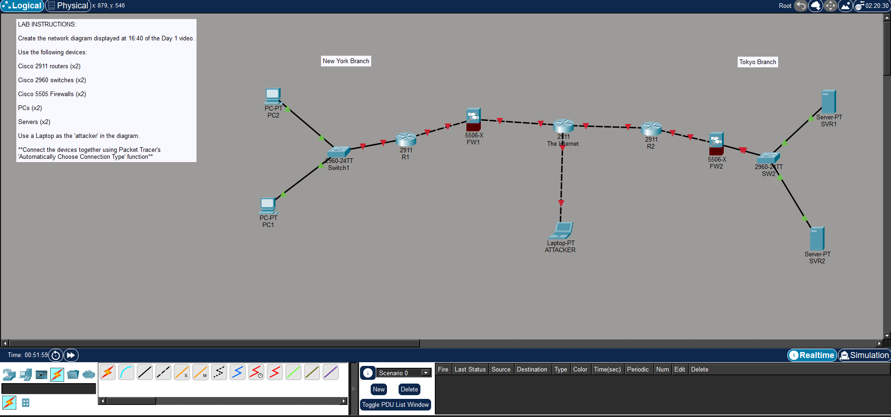

# Day 01 - Packet Tracer Introduction Lab

## 🎯 Objectives

After completing this lab, you should be able to:

* Navigate the Cisco Packet Tracer interface.
* Place network devices onto the workspace.
* Connect devices using Packet Tracer's automatic connection feature.
* Build a simple enterprise network topology based on the Day 1 lecture.

---

# 🛠️ Lab Overview

In this lab, we recreated the enterprise network shown in Jeremy's IT Lab Day 1 lesson. The topology consists of two branch offices (New York and Tokyo) connected through the Internet, with firewalls protecting each branch. An additional laptop represents an external attacker attempting to access the network.

---

# 📖 Devices Used

The topology includes:

* 2 × Cisco 2911 Routers
* 2 × Cisco 2960 Switches
* 2 × Cisco ASA 5505 Firewalls
* 2 × PCs
* 2 × Servers
* 1 × Laptop (Attacker)

All devices were connected using Packet Tracer's **Automatically Choose Connection Type** option.

---

## 🔍 Key Takeaways

- Became familiar with the Packet Tracer workspace.
- Learned how to place and organize network devices.
- Practiced connecting devices using the automatic connection tool.
- Observed how switches, routers, and firewalls are arranged in an enterprise network.

---

## 📝 Summary

This lab introduced the Packet Tracer environment by recreating the enterprise topology from Day 1. It reinforced the roles of clients, switches, routers, firewalls, and servers while preparing the workspace for future configuration labs.

## 📷 Final Topology

**Figure 1.** Completed enterprise network topology recreated in Cisco Packet Tracer based on Jeremy's IT Lab Day 1. The topology includes two branch offices connected through the Internet, with switches, routers, firewalls, clients, servers, and an external attacker.