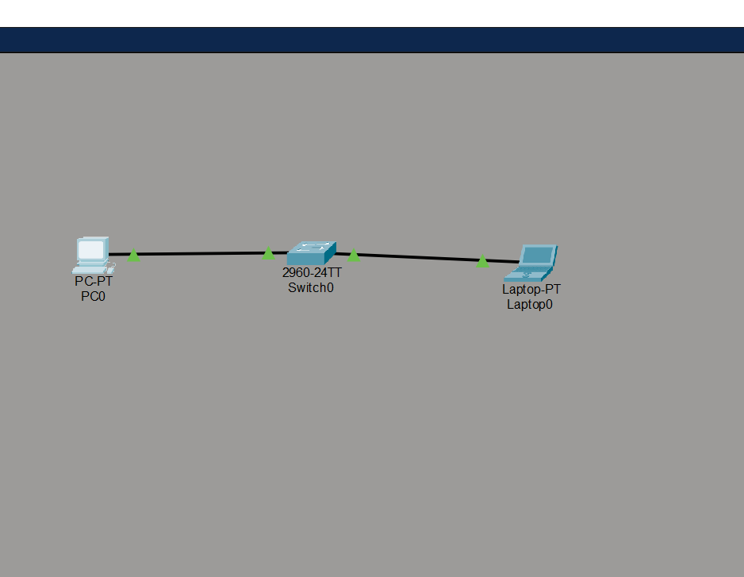
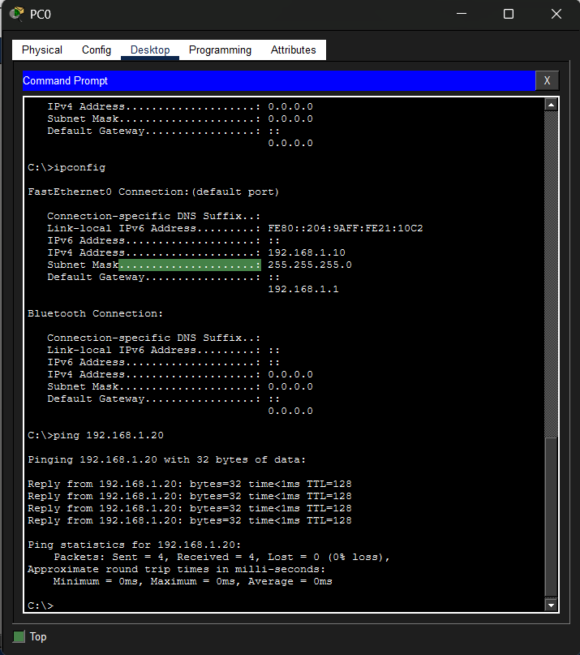
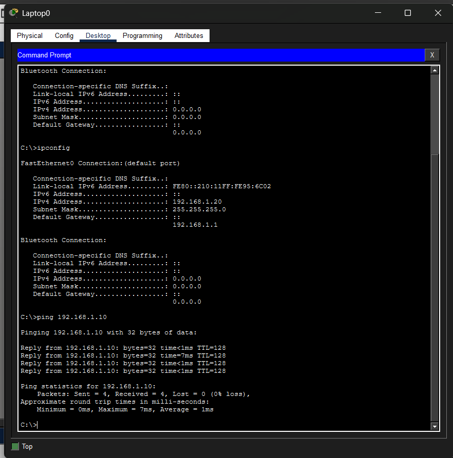

# 🧪 CCNA Lab 00 - Basic Connectivity Test

## 🎯 Objective

Explore and learn how to use Cisco Packet Tracer by configuring basic IPv4 addressing on end devices and verifying network connectivity using the `ping` command.

---

# 🖥️ Topology

```text
PC0 -------- Switch0 -------- Laptop0
```

### Devices Used

* 1 × PC
* 1 × Laptop
* 1 × Cisco 2960 Switch

### Network

**192.168.1.0/24**

---

# ⚙️ Configuration

## 💻 PC0

| Setting         | Value         |
| --------------- | ------------- |
| IP Address      | 192.168.1.10  |
| Subnet Mask     | 255.255.255.0 |
| Default Gateway | 192.168.1.1   |

## 💻 Laptop0

| Setting         | Value         |
| --------------- | ------------- |
| IP Address      | 192.168.1.20  |
| Subnet Mask     | 255.255.255.0 |
| Default Gateway | 192.168.1.1   |

Both end devices were configured through:

```text
Desktop → IP Configuration
```

After assigning the IP address, subnet mask, and default gateway, both devices became members of the same IPv4 network (**192.168.1.0/24**).

---

# ✅ Verification

Verify the network configuration on each device.

### Check IP Configuration

```cmd
ipconfig
```

Expected output:

```text
IP Address: Correctly Assigned
Subnet Mask: 255.255.255.0
Default Gateway: 192.168.1.1
```

Test connectivity from **PC0**.

```cmd
ping 192.168.1.20
```

Expected result:

```text
Reply from 192.168.1.20
Packets: Sent = 4, Received = 4, Lost = 0
```

Test connectivity from **Laptop0**.

```cmd
ping 192.168.1.10
```

Expected result:

```text
Reply from 192.168.1.10
Packets: Sent = 4, Received = 4, Lost = 0
```

Successful replies confirm that both devices can communicate across the switch.

---

# 💡 What I Learned

This lab introduced the Cisco Packet Tracer interface and demonstrated how to configure IPv4 addresses on end devices. I learned where to configure network settings, how to verify them using `ipconfig`, and how to test connectivity with the `ping` command.

I also observed that hosts within the same subnet communicate directly through a Layer 2 switch without requiring a router, providing a practical introduction to basic LAN communication.

---

# 📝 Summary

This was my first Packet Tracer lab while beginning the CCNA course with Jeremy's IT Lab. The objective was not only to establish connectivity but also to become familiar with the Packet Tracer environment. By completing this lab, I gained hands-on experience with basic device configuration, IPv4 addressing, and network verification, creating a strong foundation for future CCNA labs.

---

# 📷 Topology Screenshot



**Figure 1:** Basic network topology consisting of a PC and a laptop connected through a Cisco 2960 switch.



**Figure 2:** PC0 IPv4 configuration and successful connectivity verification using the `ping` command.



**Figure 3:** Laptop0 IPv4 configuration and successful connectivity verification using the `ping` command.

---

### 📁 Packet Tracer File

```text
Day00-basic-ping.pkt
```
