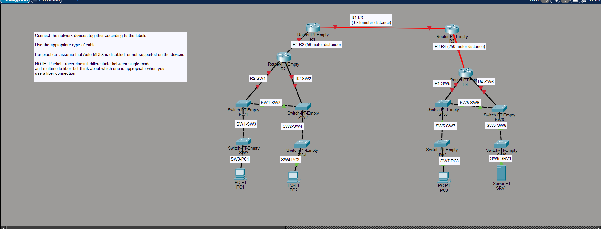

# 🧪 Day 02 - Packet Tracer Lab: Ethernet Cables and Fiber Connections

## 🎯 Objectives

By the end of this lab, I will be able to identify the correct cable type for different network devices, apply Ethernet cabling rules, choose the appropriate fiber-optic cable based on transmission distance, and understand when straight-through, crossover, UTP, and fiber-optic cables should be used.

---

# 📖 Main Section

## 🔌 Ethernet Cable Selection

This lab focused on selecting the appropriate cable type based on the devices being connected. Rather than configuring network settings, the objective was to understand how physical connections affect communication between devices.

## 🔀 Straight-Through vs Crossover

Straight-through cables are used to connect different device types, such as a PC to a switch or a router to a switch. Crossover cables are traditionally used to connect similar devices, such as two switches or two routers, by swapping the transmit and receive wire pairs.

## 🔄 Auto MDI-X

The lab assumed that Auto MDI-X was disabled, requiring manual selection of the correct cable type. This reinforced the traditional Ethernet cabling rules and demonstrated why choosing the correct cable was important on older networking equipment.

## 💡 Fiber-Optic Connections

Fiber-optic cables were selected for links requiring longer transmission distances. I learned that multimode fiber is suitable for shorter distances, while single-mode fiber is preferred for long-distance communication.

## 📷 Network Topology

**Figure 1:** Packet Tracer topology demonstrating the use of straight-through cables, crossover cables, UTP Ethernet, multimode fiber, and single-mode fiber based on device type and transmission distance.

---

# 📝 Summary

This lab reinforced the physical layer concepts introduced in Day 2 by applying Ethernet cabling standards in Packet Tracer. I practiced selecting the correct cable for different networking scenarios and gained a better understanding of how cable type, device type, and transmission distance influence network connectivity.
