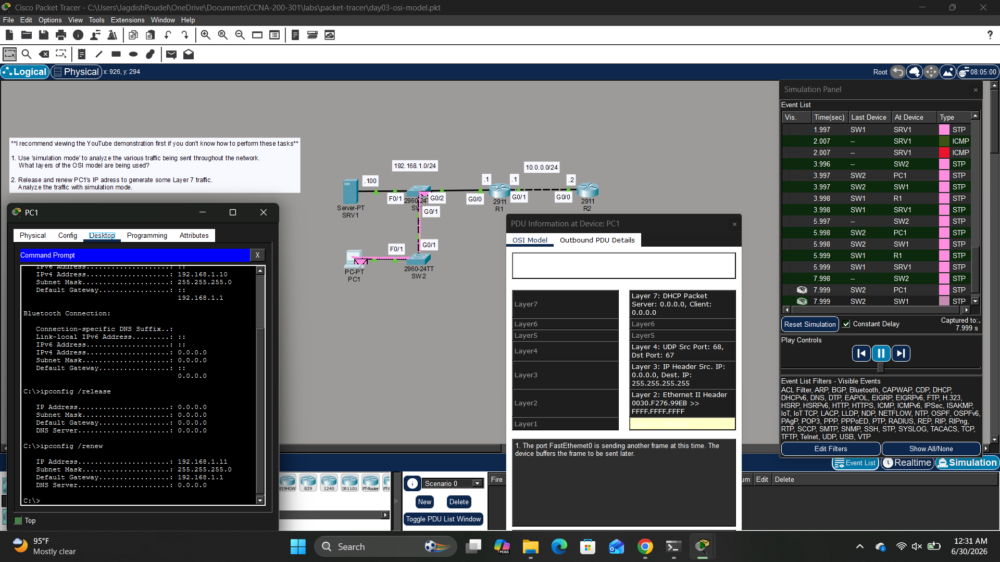

# 🌐 Day 03 - Packet Tracer Lab

## 🎯 Objective

Use Packet Tracer's Simulation Mode to observe how data moves through the OSI and TCP/IP models during DHCP communication. Learn how each protocol operates at different layers and understand the encapsulation process.

---

# 📖 Main Section

## 🔹 Devices Used

* 1 PC (PC1)
* 1 Server (SRV1)
* 2 Cisco 2960 Switches (SW1, SW2)
* 2 Cisco 2911 Routers (R1, R2)

## 🔹 Topology

* PC1 connects to SW2.
* SW2 connects to SW1.
* SW1 connects to SRV1 and Router R1.
* R1 connects to Router R2.
* The network includes:

  * **192.168.1.0/24**
  * **10.0.0.0/24**

## 🔹 What I Learned

* Simulation Mode allows packets to be examined as they travel through the network.
* A DHCP Request is sent as a broadcast because the client does not yet have an IP address.
* Packet Tracer displays how data is encapsulated through the OSI layers.
* Different protocols operate at different layers of the OSI model.
* The PDU Information window shows the protocol information added at each layer before transmission.

## 🔹 Key Concepts

* OSI Model
* TCP/IP Model
* Encapsulation
* Decapsulation
* DHCP Discover/Request
* UDP Ports 67 and 68
* Broadcast Communication
* Ethernet Frame
* IP Packet

## 🔹 Image

### OSI Model Simulation

**Description**

The screenshot shows Packet Tracer in Simulation Mode while PC1 requests a new IP address using DHCP (`ipconfig /release` and `ipconfig /renew`). The PDU Information window displays the packet as it moves through the OSI layers, showing the Layer 7 DHCP message, UDP transport, IP addressing, and Ethernet frame before transmission.

---

# 📝 Summary

This lab demonstrated how Packet Tracer visualizes communication using the OSI model. By observing a DHCP exchange, I learned how data is encapsulated into different protocol headers at each layer and how Simulation Mode can be used to troubleshoot and understand network communication.
