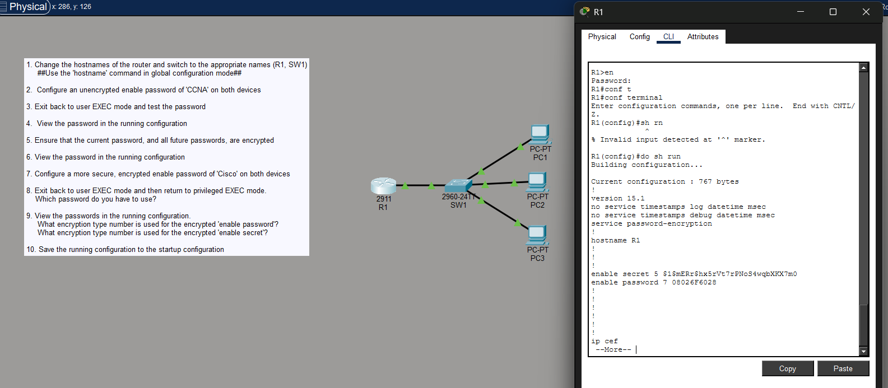
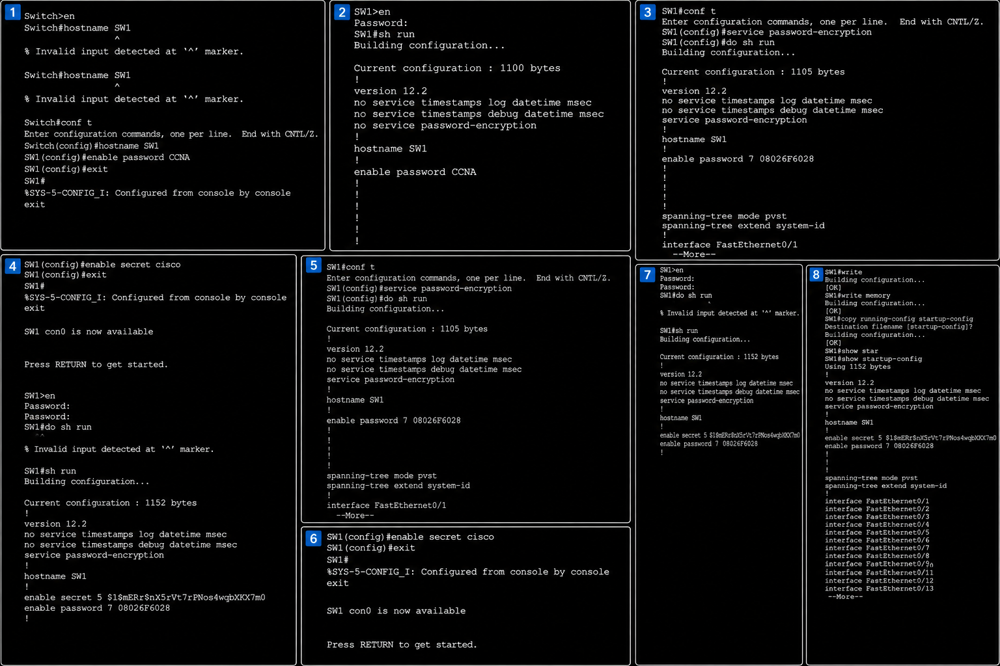

# 🌐 Day 04 - Packet Tracer Lab

## 🎯 Objective

Practice navigating the Cisco IOS CLI, configuring basic device settings, securing Privileged EXEC mode, viewing configurations, and saving the running configuration to the startup configuration.

---

# 📖 Main Section

## 🔹 Devices Used

- 1 Cisco 2911 Router (R1)
- 1 Cisco 2960 Switch (SW1)
- 3 PCs
- Console connection

---

## 🔹 Topology

```text
          R1
           │
          SW1
      ┌────┼────┐
     PC1  PC2  PC3
```

The router connects to the switch, and the switch connects to three end devices.

---

## 🔹 Tasks Performed

Completed the following tasks:

- Changed device hostnames.
- Configured an `enable password`.
- Verified the password in the running configuration.
- Enabled `service password-encryption`.
- Verified encrypted passwords.
- Configured an `enable secret`.
- Tested Privileged EXEC authentication.
- Used the `do` command in Global Configuration Mode.
- Viewed the running configuration.
- Saved the running configuration to the startup configuration.

---

## 🔹 Commands Practiced

```text
enable
configure terminal
hostname
enable password
service password-encryption
enable secret
show running-config
show startup-config
do show running-config
write
write memory
copy running-config startup-config
exit
```

---

## 🔹 Key Concepts

### Cisco IOS Modes

Cisco IOS provides different modes, each with its own purpose and available commands.

- **User EXEC (`>`)** – Basic monitoring commands.
- **Privileged EXEC (`#`)** – Administrative commands and access to configuration modes.
- **Global Configuration (`(config)#`)** – Used to configure the device.

---

### The `do` Command

The `do` command allows Privileged EXEC commands to be executed without leaving Global Configuration Mode.

**Example**

```text
R1(config)# do show running-config
```

---

### Password Protection

Two privileged passwords were configured during the lab.

#### `enable password`

- Stored in plain text by default.
- Can be encrypted using `service password-encryption`.
- Uses Cisco **Type 7** encryption.

#### `enable secret`

- Always stored in encrypted form.
- Uses **MD5 (Type 5)** hashing.
- Takes precedence over `enable password`.

---

### Running Configuration

The **running configuration** is stored in **RAM** and contains the active configuration currently used by the device.

View the running configuration with:

```text
show running-config
```

---

### Startup Configuration

The **startup configuration** is stored in **NVRAM** and is loaded whenever the device boots.

View the startup configuration with:

```text
show startup-config
```

---

### Saving Configuration

The running configuration was copied to the startup configuration.

The following commands perform the same function:

```text
write
```

```text
write memory
```

```text
copy running-config startup-config
```

---

## 🔹 Common Mistakes

### Using `show` Inside Configuration Mode

**Incorrect**

```text
(config)# show running-config
```

**Correct**

```text
(config)# do show running-config
```

---

### Changing the Hostname

The `hostname` command only works in **Global Configuration Mode**.

**Incorrect**

```text
Switch# hostname SW1
```

**Correct**

```text
Switch(config)# hostname SW1
```

---

### `enable secret` vs `enable password`

If both commands are configured:

```text
enable secret
```

is always used when entering **Privileged EXEC Mode** because it is more secure.

---

## 🔹 Image

### Day 04 Packet Tracer Lab





**Description**

Configured the router and switch using the Cisco IOS CLI, secured privileged access with passwords, viewed running and startup configurations, and saved the running configuration to NVRAM.

---

# 🔗 Connections to Previous Lessons

- Cisco IOS CLI is used to configure the routers and switches introduced in **Day 01**.
- Configuration changes determine how devices participate in the **TCP/IP communication process** learned in **Day 03**.
- These CLI skills will be used throughout all future CCNA Packet Tracer labs.

---

# 📝 Summary

- Learned to navigate Cisco IOS CLI modes.
- Configured device hostnames.
- Configured and tested `enable password` and `enable secret`.
- Used `service password-encryption` to encrypt passwords.
- Learned the purpose of the `do` command.
- Viewed the running and startup configurations.
- Saved the running configuration to NVRAM.
- Built a strong foundation for configuring Cisco devices in future CCNA labs.

---

## 💡 CCNA Tip

One of the most common CCNA exam and interview questions is:

> **Which password is used if both `enable password` and `enable secret` are configured?**

**Answer**

`enable secret`

It always takes precedence because it provides stronger security than `enable password`.