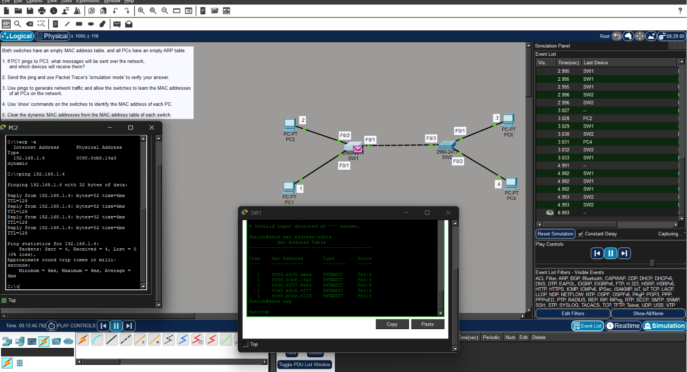
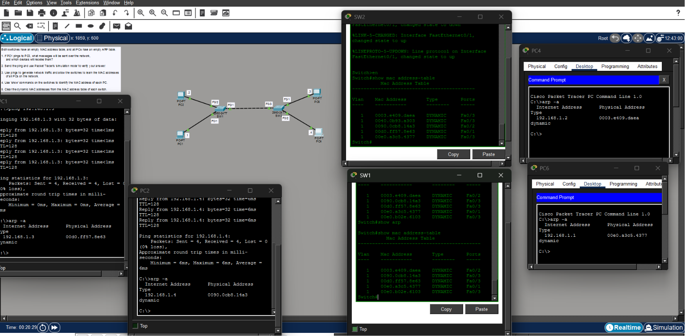
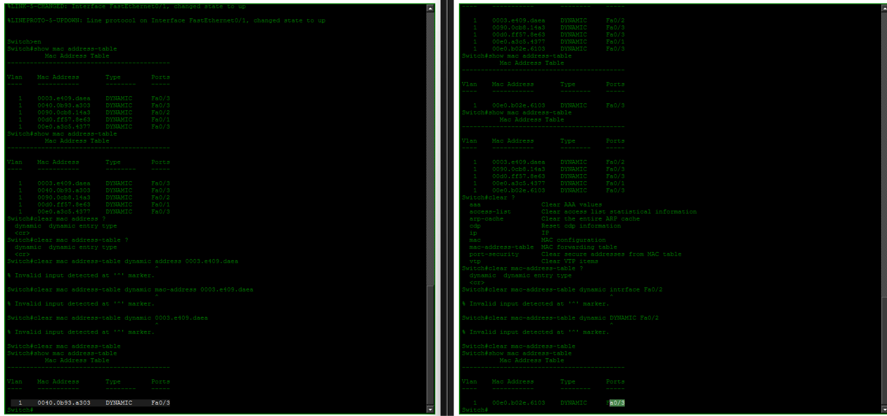

# 🌐 Day 06 - Ethernet LAN Switching

## 🎯 Objectives

- Understand how Ethernet switches forward frames.
- Learn how switches dynamically build their MAC address tables.
- Explain the relationship between ARP and Ethernet communication.
- Observe MAC learning using Packet Tracer Simulation Mode.
- Understand MAC address aging and table clearing.

---

# 📖 Ethernet Frame Forwarding

An Ethernet switch forwards frames based on the destination MAC address stored in its MAC address table.

When a frame enters a switch, the switch performs two important actions:

1. Learns the **source MAC address**.
2. Looks up the **destination MAC address** in its MAC address table.

Depending on whether the destination MAC address is known, the switch either forwards the frame to a specific interface or floods it to all ports except the incoming port.

---

# 📖 MAC Address Learning

Switches build their MAC address tables dynamically.

Whenever a frame enters an interface, the switch records:

- Source MAC address
- Incoming interface
- VLAN

This allows future frames destined for that MAC address to be forwarded only to the correct port.

> **Key Point**
>
> A switch **only learns source MAC addresses**. It never learns destination MAC addresses directly.

### 📷 Example - Dynamic MAC Learning



After several successful pings, both switches dynamically learned the MAC addresses of connected hosts. Local devices were associated with their access ports, while remote devices were learned through the inter-switch link.

---

# 📖 ARP Before ICMP

Before a host can send an ICMP Echo Request (ping), it must first determine the destination MAC address.

If the MAC address is unknown, the host broadcasts an ARP Request.

The destination replies with an ARP Reply containing its MAC address.

Only after ARP completes can the ICMP Echo Request be sent.

This explains why the **first ping** is often slightly slower than subsequent pings.

### 📷 Example - Packet Tracer Simulation



Simulation Mode clearly shows the communication sequence:

1. ARP Request (Broadcast)
2. ARP Reply
3. ICMP Echo Request
4. ICMP Echo Reply

This demonstrates that Layer 2 address resolution occurs before Layer 3 communication.

---

# 📖 ARP Cache

Each PC maintains an ARP cache that stores recently learned IP-to-MAC mappings.

The cache prevents unnecessary ARP broadcasts by allowing devices to reuse previously learned MAC addresses.

Example command:

```bash
arp -a
```

After successful communication, the ARP cache contains dynamic entries mapping remote IP addresses to their corresponding MAC addresses.

---

# 📖 MAC Address Table

Cisco switches maintain a MAC address table that associates MAC addresses with switch interfaces.

Example command:

```bash
show mac address-table
```

The output displays:

- VLAN
- MAC Address
- Entry Type (Dynamic or Static)
- Associated Interface

Dynamic entries are created automatically when traffic is received.

---

# 📖 MAC Address Aging

Dynamic MAC address entries are not permanent.

If no traffic is received from a device for a period of time, the switch automatically removes the entry from the MAC address table. This process is known as **MAC aging**.

Once the entry ages out, the switch must relearn the MAC address the next time it receives a frame from that device.

> **Key Point**
>
> An empty MAC address table does not necessarily indicate a problem. The entries may have simply aged out due to inactivity.

---

# 📖 Clearing the MAC Address Table

Network engineers sometimes clear the MAC address table to force the switch to relearn connected devices.

Supported command:

```bash
clear mac address-table dynamic
```

### 📷 Example - Clearing Dynamic MAC Entries



During the lab, attempts were made to remove individual MAC addresses and interface-specific entries.

Packet Tracer returned:

```text
% Invalid input detected at '^' marker.
```

This is **not** because the Cisco IOS command is incorrect. Instead, Packet Tracer implements only a subset of IOS commands and does not support some granular MAC table clearing options that exist on real Cisco switches.

---

# 📖 Packet Tracer Limitation

One limitation observed during the lab is that Packet Tracer does not fully implement every Cisco IOS command.

For example, commands such as:

```bash
clear mac address-table dynamic interface Fa0/2
```

and

```bash
clear mac address-table dynamic mac-address <mac-address>
```

were not supported.

Only the following command successfully cleared the learned entries:

```bash
clear mac address-table dynamic
```

This is a limitation of Packet Tracer rather than Ethernet switching itself.

---

# 📝 Summary

- Ethernet switches forward frames based on destination MAC addresses.
- Switches dynamically learn only **source MAC addresses**.
- ARP resolves IP addresses into MAC addresses before ICMP communication.
- ARP entries are stored in a host's ARP cache.
- Switches maintain MAC address tables that associate MAC addresses with interfaces.
- Dynamic MAC entries age out after a period of inactivity.
- The MAC address table can be cleared to force relearning.
- Packet Tracer supports only a subset of Cisco IOS commands, so some MAC table clearing options available on real switches are not implemented.

## 📚 Credits

This lab is based on the excellent **CCNA 200-301** course by **Jeremy's IT Lab**.  
These notes were created as a personal study reference and summarize the hands-on Packet Tracer lab completed while following the course.