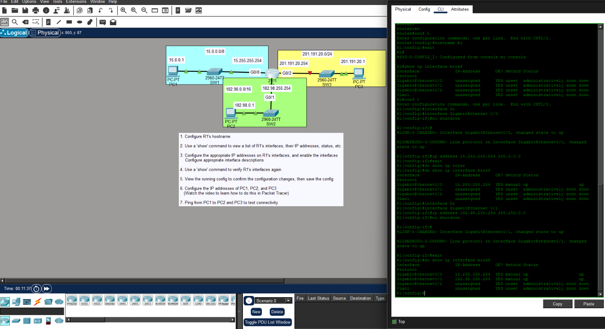
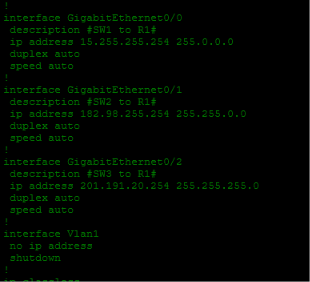
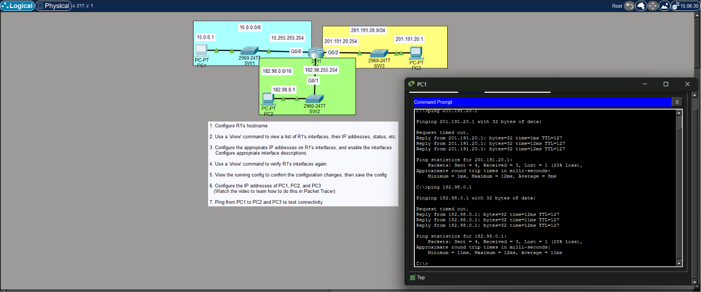

# 🌐 Day 08 - IPv4 Addressing Lab Notes

## 🎯 Objectives

- Configure a router hostname.
- Configure IPv4 addresses on router interfaces.
- Enable router interfaces using `no shutdown`.
- Verify interface status with Cisco IOS commands.
- Save the router configuration.
- Test connectivity between different IPv4 networks.

---

# 📖 Lab Topology

The topology consisted of one Cisco 2911 router connecting three separate LANs.

| Network | Router Interface | Router IP | PC IP |
|---------|------------------|-----------|-------|
| 15.0.0.0/8 | G0/0 | 15.255.255.254 | 15.0.0.1 |
| 182.98.0.0/16 | G0/1 | 182.98.255.254 | 182.98.0.1 |
| 201.191.20.0/24 | G0/2 | 201.191.20.254 | 201.191.20.1 |

---

# 📖 Router Configuration

The router was configured with:

- Hostname
- Interface descriptions
- IPv4 addresses
- Enabled interfaces

Example configuration:

```bash
hostname R1

interface GigabitEthernet0/0
 description SW1 to R1
 ip address 15.255.255.254 255.0.0.0
 no shutdown

interface GigabitEthernet0/1
 description SW2 to R1
 ip address 182.98.255.254 255.255.0.0
 no shutdown

interface GigabitEthernet0/2
 description SW3 to R1
 ip address 201.191.20.254 255.255.255.0
 no shutdown
```

### 📷 Router Interface Configuration



> **Observation:** Router interfaces are administratively down by default and must be enabled using `no shutdown`.

---

# 📖 Interface Verification

The router interfaces were verified before and after configuration.

Verification command:

```bash
show ip interface brief
```

Before configuration:

- Interfaces had no IP addresses.
- Status was **administratively down/down**.

After configuration:

- Correct IPv4 addresses were assigned.
- Configured interfaces changed to **up/up**.

This command provided a quick overview of:

- Interface names
- Assigned IP addresses
- Interface status
- Protocol status

---

# 📖 Running Configuration

The running configuration was reviewed to verify that:

- Interface descriptions were present.
- IPv4 addresses were correctly assigned.
- Interfaces were enabled.

Example command:

```bash
show running-config
```

### 📷 Running Configuration



> **Observation:** Reviewing the running configuration is an important verification step before saving changes.

---

# 📖 Connectivity Testing

After configuring all devices, connectivity was tested using ICMP.

Example:

```bash
ping 201.191.20.1

ping 182.98.0.1
```

### 📷 Ping Verification



Observed results:

- The **first ping request timed out**.
- The remaining replies were successful.

> **Observation:** The first ping timed out because ARP had to resolve the destination MAC address before ICMP packets could be forwarded. Once the ARP cache was populated, subsequent pings succeeded.

---

# 📖 Verification Commands Used

```bash
show ip interface brief
```

Used to verify:

- Interface status
- Assigned IP addresses

---

```bash
show running-config
```

Used to verify:

- Interface configuration
- Descriptions
- IPv4 addressing

---

```bash
ping
```

Used to verify:

- End-to-end Layer 3 connectivity between networks.

---

# 🔍 Lab Observations

- Router interfaces are administratively down by default.
- Interfaces require the `no shutdown` command before they can forward traffic.
- `show ip interface brief` is the quickest command to verify interface status.
- Interface descriptions improve network documentation.
- The first ping may fail due to ARP resolution.
- Successful replies after the first ping confirmed proper IPv4 addressing and routing.

---

# ⚠️ Lab-Specific Notes

### Initial Interface Status

Before configuration, all router interfaces appeared as:

```text
administratively down/down
```

After assigning IP addresses and issuing `no shutdown`, the interfaces transitioned to:

```text
up/up
```

---

### First Ping Timeout

The first ICMP Echo Request timed out during connectivity testing.

This was expected behavior because the devices first needed to resolve the destination MAC address through ARP before forwarding ICMP traffic.

Subsequent ping replies were successful without additional delays.

---

# 📝 Summary

- Configured IPv4 addresses on three router interfaces.
- Assigned descriptive labels to interfaces.
- Enabled interfaces using `no shutdown`.
- Verified interface status using `show ip interface brief`.
- Verified the running configuration using `show running-config`.
- Successfully tested end-to-end connectivity using `ping`.
- Observed ARP resolution causing the first ping to time out before normal communication began.

## 📚 Credits

This lab is based on the excellent **CCNA 200-301** course by **Jeremy's IT Lab**.  
These notes were created as a personal study reference and summarize the hands-on Packet Tracer lab completed while following the course.