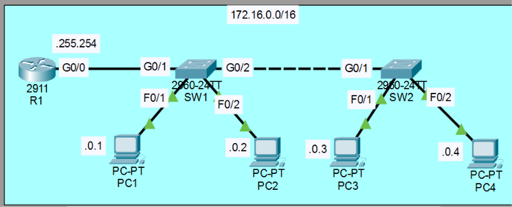
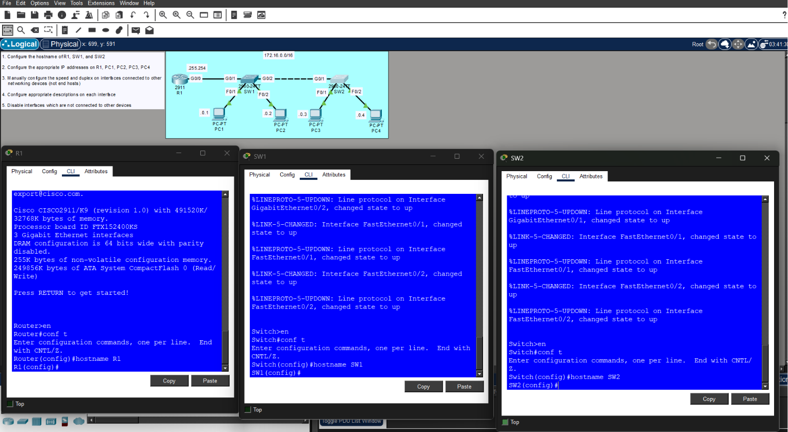
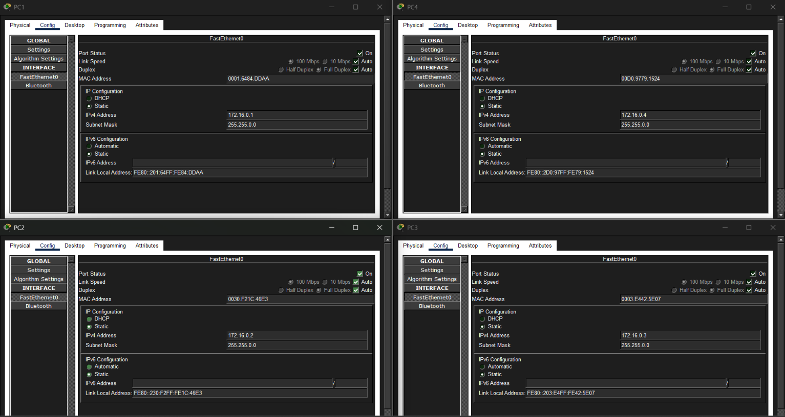
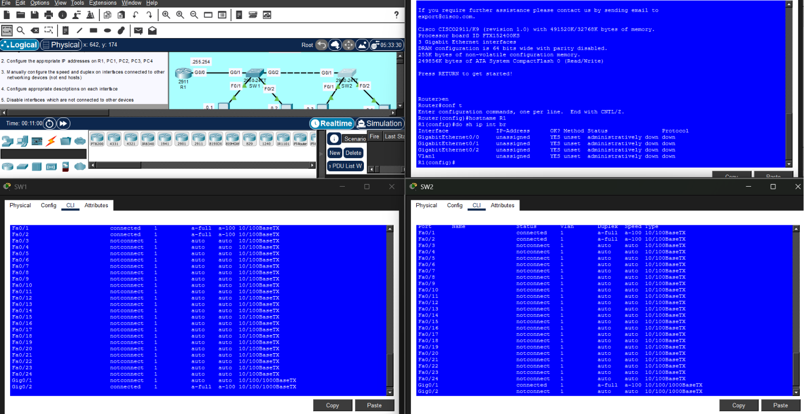
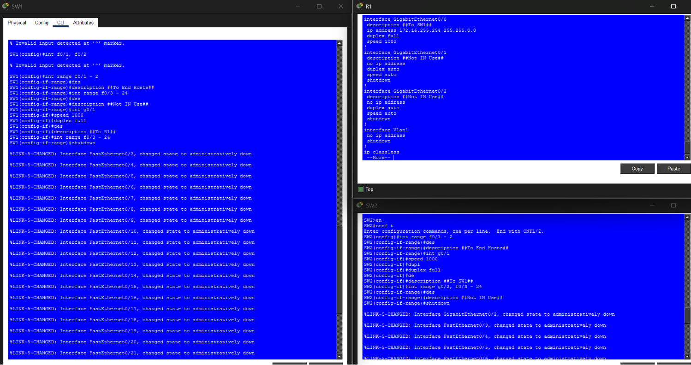

# 🌐 Day 09 - Configuring Interfaces (Lab Notes)

> **Lab Source:** Jeremy's IT Lab - CCNA 200-301 Day 09 (Configuring Interfaces)  
> These notes summarize the practical tasks performed during the Packet Tracer lab and are intended to complement the theory notes.

---

## 🎯 Objectives

- Configure hostnames on network devices.
- Assign IPv4 addresses to the router and PCs.
- Configure interface descriptions.
- Manually configure interface speed and duplex where required.
- Disable unused interfaces for improved security.
- Verify interface status after configuration.

---

# 📖 Lab Topology

The lab consisted of one Cisco 2911 router, two Cisco 2960 switches, and four PCs connected within a single IPv4 network.

| Device | Connection |
|---------|------------|
| R1 G0/0 | SW1 G0/1 |
| SW1 G0/2 | SW2 G0/1 |
| SW1 F0/1 | PC1 |
| SW1 F0/2 | PC2 |
| SW2 F0/1 | PC3 |
| SW2 F0/2 | PC4 |

Network:

```
172.16.0.0/16
```

### 📷 Lab Topology



---

# 📖 Device Hostnames

The first task was assigning meaningful hostnames to each device.

Configured hostnames:

| Device | Hostname |
|---------|----------|
| Router | R1 |
| Switch 1 | SW1 |
| Switch 2 | SW2 |

Example:

```bash
Router(config)# hostname R1

Switch(config)# hostname SW1

Switch(config)# hostname SW2
```

### 📷 Hostname Configuration



> **Observation:** Assigning hostnames makes CLI prompts easier to identify and improves device management.

---

# 📖 IPv4 Address Configuration

Static IPv4 addresses were configured on the router interface and all PCs.

| Device | Interface | IPv4 Address | Subnet Mask |
|---------|-----------|--------------|-------------|
| R1 | G0/0 | 172.16.255.254 | 255.255.0.0 |
| PC1 | NIC | 172.16.0.1 | 255.255.0.0 |
| PC2 | NIC | 172.16.0.2 | 255.255.0.0 |
| PC3 | NIC | 172.16.0.3 | 255.255.0.0 |
| PC4 | NIC | 172.16.0.4 | 255.255.0.0 |

### 📷 PC IPv4 Configuration



> **Observation:** Every host belonged to the same `/16` network, allowing communication through the connected switches.

---

# 📖 Interface Verification

The router interfaces were verified before configuration.

Command used:

```bash
show ip interface brief
```

Observed:

- Interfaces initially had no IP address.
- Interfaces were administratively down.

After configuration:

- Configured interfaces received IPv4 addresses.
- Connected interfaces transitioned to the **up/up** state.

### 📷 Interface Verification



> **Observation:** `show ip interface brief` provides a quick summary of interface addresses and operational status.

---

# 📖 Switch Interface Status

The switches were inspected to determine which interfaces were connected and which remained unused.

Observation:

- Connected interfaces showed **connected**.
- Unused interfaces showed **notconnect**.

This information was later used to determine which interfaces should be administratively disabled.


---

# 📖 Interface Descriptions

Descriptions were configured to identify connected devices.

Examples:

Router

```bash
interface GigabitEthernet0/0
 description ##To SW1##
```

Switches

```bash
interface FastEthernet0/1
 description ##To End Hosts##
```

```bash
interface GigabitEthernet0/1
 description ##To R1##
```

```bash
interface GigabitEthernet0/2
 description ##To SW2##
```

> **Observation:** Interface descriptions improve documentation and simplify troubleshooting.

---

# 📖 Manual Speed and Duplex Configuration

Interfaces connected between networking devices were manually configured.

Example:

```bash
speed 1000
duplex full
```

Only infrastructure links were manually configured.

End-host interfaces remained at their default auto-negotiation settings.

---

# 📖 Disabling Unused Interfaces

Unused switch interfaces were administratively disabled.

Example:

```bash
interface range fa0/3-24

shutdown
```

Descriptions were also added.

```bash
description ##Not IN Use##
```

### 📷 Interface Security Configuration



> **Observation:** Administratively shutting down unused interfaces reduces unnecessary access points and is considered a networking best practice.

---

# 📖 Running Configuration Review

The running configuration was reviewed to verify:

- IPv4 addressing
- Interface descriptions
- Speed and duplex settings
- Shutdown status of unused interfaces

Command:

```bash
show running-config
```

This confirmed that the intended configuration had been successfully applied.

---

# 🔍 Lab Observations

- Router interfaces require manual configuration before use.
- Hostnames make device identification easier.
- Interface descriptions improve documentation.
- `show ip interface brief` provides a quick interface health check.
- Connected switch ports remain active while unused ports can be disabled.
- Infrastructure links can be manually configured for speed and duplex.
- Disabling unused interfaces improves basic network security.

---

# ⚠️ Lab-Specific Notes

### Invalid Interface Range Syntax

An incorrect interface range command generated:

```text
% Invalid input detected at '^' marker.
```

Example of incorrect syntax:

```bash
interface f0/1, f0/2
```

Correct syntax:

```bash
interface range fa0/1-2
```

> **Observation:** Cisco IOS requires the `interface range` keyword when configuring multiple interfaces simultaneously.

---

### Connected vs NotConnect

During verification:

- **connected** indicated an active physical connection.
- **notconnect** indicated no device was attached.

Only unused interfaces were administratively shut down.

---

# 📝 Summary

- Configured hostnames for the router and both switches.
- Assigned static IPv4 addresses to the router and PCs.
- Verified interface status using `show ip interface brief`.
- Added interface descriptions for easier identification.
- Configured manual speed and duplex on infrastructure links.
- Identified connected and unused switch interfaces.
- Disabled unused interfaces and labeled them appropriately.
- Reviewed the running configuration to verify all settings.

---

## 📚 Credits

This lab is based on the excellent **CCNA 200-301** course by **Jeremy's IT Lab**.  
These notes were created as a personal study reference and summarize the hands-on Packet Tracer lab completed while following the course.