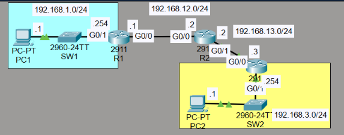
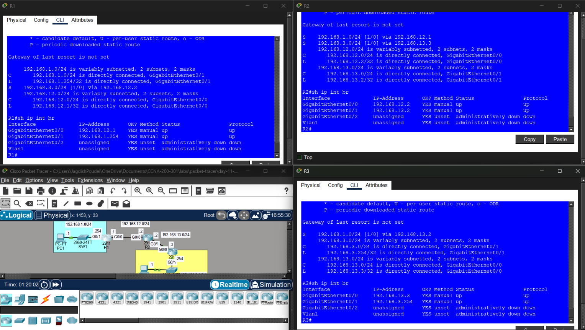
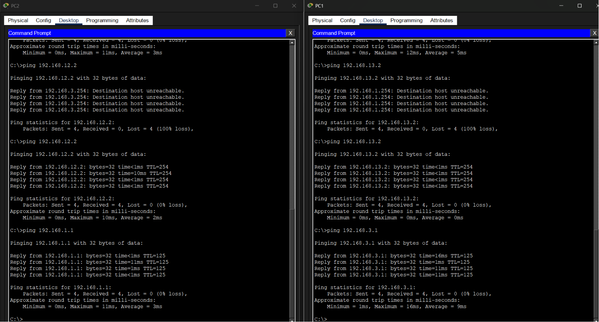

# 🌐 Day 11 - Configuring Static Routes (Lab Notes)

> **Lab Source:** Jeremy's IT Lab - CCNA 200-301 Day 11 (Static Routing)  
> These notes summarize the hands-on Packet Tracer lab and complement the theory notes.

---

## 🎯 Objectives

- Configure IPv4 addressing on routers and PCs.
- Configure static routes using next-hop IP addresses.
- Verify routing tables and interface status.
- Test end-to-end connectivity between remote LANs.
- Troubleshoot failed communication caused by missing routes.

---

# 📖 Lab Topology

The lab consisted of three routers connected in series with a LAN attached to each end router.

| Network | Connected Device |
|---------|------------------|
| 192.168.1.0/24 | PC1 ↔ R1 |
| 192.168.12.0/24 | R1 ↔ R2 |
| 192.168.13.0/24 | R2 ↔ R3 |
| 192.168.3.0/24 | R3 ↔ PC2 |

### 📷 Lab Topology



---

# 📖 Static Route Configuration

Only remote destination networks required static routes.

### R1

```bash
ip route 192.168.3.0 255.255.255.0 192.168.12.2
```

### R2

```bash
ip route 192.168.1.0 255.255.255.0 192.168.12.1
ip route 192.168.3.0 255.255.255.0 192.168.13.3
```

### R3

```bash
ip route 192.168.1.0 255.255.255.0 192.168.13.2
```

### 📷 Router Routing Tables



> **Observation:** Each router only needed routes to networks that were **not directly connected**.

---

# 📖 Route Verification

The following commands were used to verify the configuration.

```bash
show ip route
```

Verified:

- Directly connected networks
- Static routes (marked with **S**)
- Next-hop IP addresses

---

```bash
show ip interface brief
```

Verified:

- Interface IP addresses
- Interface status (`up/up`)

---

# 📖 Connectivity Testing

Connectivity was tested after configuring the static routes.

Example:

```bash
ping 192.168.3.1
```

```bash
ping 192.168.1.1
```

### 📷 Ping Verification



After the correct static routes were added, PC1 and PC2 successfully communicated across all three routers.

---

# 🔍 Lab Observations

- Static routes were configured only for remote LANs.
- The next-hop IP address was used to reach remote destinations.
- `show ip route` displayed configured static routes with the **S** code.
- Successful ping replies confirmed correct routing across all routers.

---

# ⚠️ Lab-Specific Notes

### Initial Connectivity Failure

During testing, pings to the transit interfaces (`192.168.12.2` and `192.168.13.2`) initially failed with:

```text
Destination host unreachable
```

This occurred because no routes existed to those transit networks.

Although adding routes to the transit networks allowed those interface pings to succeed, **they were not required to meet the lab objective**.

---

### Static Routes Target Destination Networks

The objective was to enable communication between **PC1** and **PC2**, not between every router interface.

Only routes to the **destination LANs** were necessary.

> **Key Takeaway:** Configure static routes for **remote destination networks**, not every hop along the path.

---

# 📝 Summary

- Configured static routes on three routers.
- Used next-hop IP addresses to reach remote networks.
- Verified routing tables with `show ip route`.
- Verified interface status with `show ip interface brief`.
- Successfully restored end-to-end connectivity between PC1 and PC2.
- Reinforced that routers forward packets based on the destination network and the next hop, not the complete path.

---

## 📚 Credits

This lab is based on the excellent **CCNA 200-301** course by **Jeremy's IT Lab**.  
These notes were created as a personal study reference while completing the Packet Tracer lab.