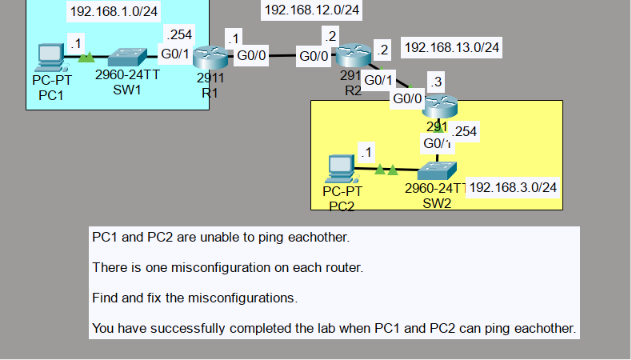
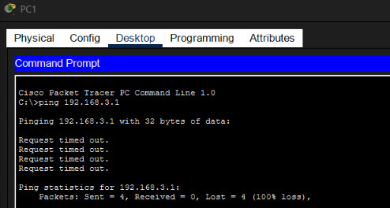
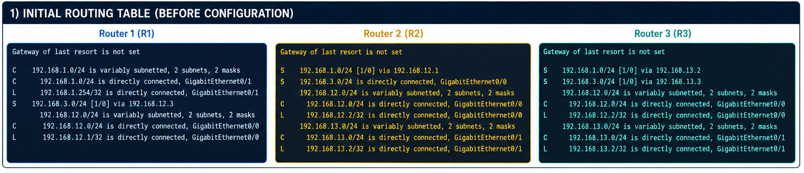
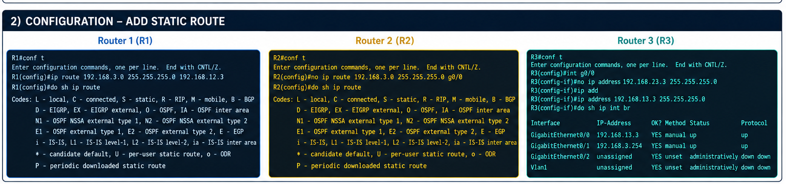
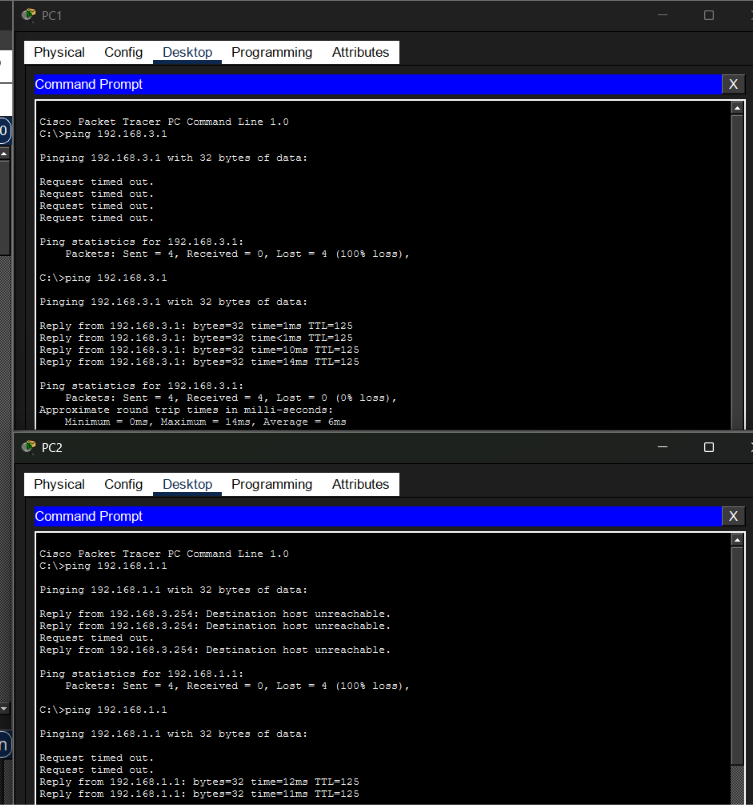

# 🌐 Day 11 - Troubleshooting Static Routes (Lab Notes)

> **Lab Source:** Jeremy's IT Lab - CCNA 200-301 Day 11 (Troubleshooting Static Routes)  
> These notes summarize the troubleshooting Packet Tracer lab and complement the static routing theory notes.

---

## 🎯 Objectives

- Troubleshoot connectivity between two remote LANs.
- Identify one routing misconfiguration on each router.
- Correct incorrect static routes.
- Verify routing tables and interface status.
- Restore end-to-end communication between PC1 and PC2.

---

# 📖 Lab Topology

Three routers connected two remote LANs through two transit networks.

| Network | Purpose |
|---------|---------|
| 192.168.1.0/24 | PC1 LAN |
| 192.168.12.0/24 | R1 ↔ R2 Transit |
| 192.168.13.0/24 | R2 ↔ R3 Transit |
| 192.168.3.0/24 | PC2 LAN |

### 📷 Lab Topology



---

# 📖 Troubleshooting Process

The lab started with PC1 and PC2 unable to communicate.

Initial testing:

```bash
ping 192.168.3.1
```

```bash
ping 192.168.1.1
```

Both tests failed, confirming a routing problem.

### 📷 Initial Connectivity Failure



---

# 📖 Verifying Router Configuration

Each router was inspected using:

```bash
show ip route
```

and

```bash
show ip interface brief
```

The routing tables revealed one incorrect static route on each router.

### 📷 Route Verification



---

# 📖 Correcting the Static Routes

Incorrect static routes were removed using:

```bash
no ip route <destination-network> <subnet-mask> <next-hop>
```

Correct routes were then added.

Example:

```bash
ip route 192.168.3.0 255.255.255.0 192.168.12.2
```

After correcting the routes, the routing tables displayed the proper next-hop addresses.

### 📷 Corrected Routing Tables



---

# 📖 Connectivity Verification

After correcting the routing tables, connectivity was tested again.

Commands used:

```bash
ping 192.168.3.1
```

```bash
ping 192.168.1.1
```

The pings completed successfully, confirming that packets could traverse all three routers.

### 📷 Successful Ping Test



---

# 🔍 Lab Observations

- Incorrect static routes prevented communication between the remote LANs.
- `show ip route` was the primary troubleshooting command.
- Removing an incorrect static route before adding the correct one prevented conflicting entries.
- Successful ping replies confirmed that routing had been restored.

---

# ⚠️ Lab-Specific Notes

### One Misconfiguration Per Router

Each router contained exactly **one incorrect static route**.

Rather than rebuilding the routing table, each incorrect route was:

1. Identified
2. Removed
3. Replaced with the correct next-hop address

---

### Verify Before Changing

Instead of immediately modifying the configuration, the routing table was verified first using:

```bash
show ip route
```

This made it easier to locate the incorrect route and apply only the required fix.

> **Key Takeaway:** Always verify the routing table before making configuration changes.

---

# 📝 Summary

- Diagnosed failed communication using `ping`.
- Verified routing tables with `show ip route`.
- Identified one incorrect static route on each router.
- Removed incorrect routes using `no ip route`.
- Configured the correct static routes.
- Successfully restored end-to-end connectivity between PC1 and PC2.
- Reinforced a structured troubleshooting methodology: **Test → Verify → Identify → Correct → Verify Again**.

---

## 📚 Credits

This lab is based on the excellent **CCNA 200-301** course by **Jeremy's IT Lab**.  
These notes were created as a personal study reference while completing the Packet Tracer troubleshooting lab.