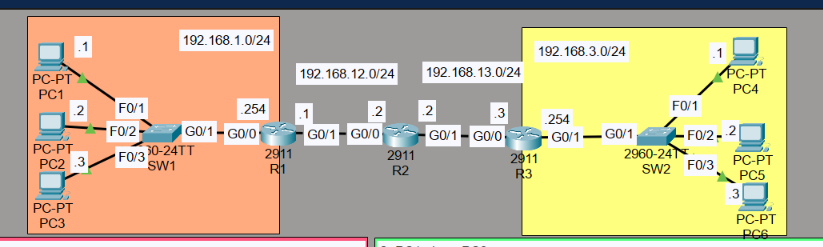
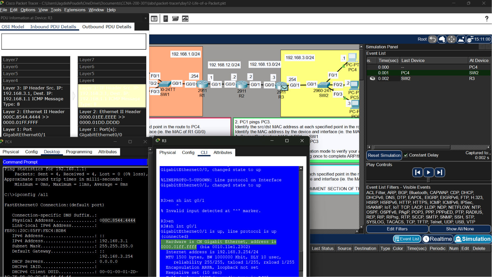

# 🌐 Day 12 - Life of a Packet (Lab Notes)

> **Lab Source:** Jeremy's IT Lab - CCNA 200-301 Day 12 (Life of a Packet)  
> These notes summarize the Packet Tracer analysis lab and complement the packet forwarding theory notes.

---

## 🎯 Objectives

- Analyze how an IP packet travels across multiple networks.
- Observe how Layer 2 headers change at each hop.
- Verify that Layer 3 addresses remain unchanged during forwarding.
- Use Packet Tracer Simulation Mode to inspect packet encapsulation.
- Identify MAC addresses used on each network segment.

---

# 📖 Lab Topology

The lab consisted of three routers connecting two LANs.

| Network | Devices |
|---------|---------|
| 192.168.1.0/24 | PC1, PC2, PC3, SW1, R1 |
| 192.168.12.0/24 | R1 ↔ R2 |
| 192.168.13.0/24 | R2 ↔ R3 |
| 192.168.3.0/24 | R3, SW2, PC4, PC5, PC6 |

### 📷 Lab Topology



---

# 📖 Simulation Mode Analysis

Packet Tracer Simulation Mode was used to inspect packets as they moved between devices.

For each hop, the following information was observed:

- Layer 2 (Ethernet) Header
- Layer 3 (IP) Header
- Incoming Interface
- Outgoing Interface

### 📷 Packet Inspection



> **Observation:** Simulation Mode clearly shows how routers remove and rebuild the Layer 2 Ethernet header before forwarding a packet to the next hop.

---

# 📖 Packet Flow Across Routers

When **PC1** communicated with **PC4**, the packet traversed three routers.

At every router:

- The Ethernet frame was removed.
- The IP packet was examined.
- A new Ethernet frame was created for the next network segment.

Although the Ethernet header changed at every hop, the IP packet remained the same.

---

# 📖 Layer 2 vs Layer 3 Addressing

### Layer 2 (Changes at Every Hop)

Each router creates a **new Ethernet frame** using:

- Source MAC = Outgoing interface
- Destination MAC = Next-hop interface (or destination host if directly connected)

Example:

```
PC1 → R1
Source MAC = PC1
Destination MAC = R1 G0/0
```

```
R1 → R2
Source MAC = R1 G0/1
Destination MAC = R2 G0/0
```

```
R2 → R3
Source MAC = R2 G0/1
Destination MAC = R3 G0/0
```

```
R3 → PC4
Source MAC = R3 G0/1
Destination MAC = PC4
```

---

### Layer 3 (Never Changes)

Throughout the entire journey:

```
Source IP:
192.168.1.1
```

```
Destination IP:
192.168.3.1
```

These addresses remained unchanged from the source host to the destination host.

---

# 📖 Same-Network Communication

The lab also analyzed communication between **PC1** and **PC3**, which are located on the same subnet.

In this case:

- No router was involved.
- The frame was sent directly to PC3.
- SW1 simply forwarded the frame based on its MAC address table.

The source and destination MAC addresses remained the same across the switch because switches do not modify Ethernet headers.

---

# 🔍 Lab Observations

- Routers replace the Layer 2 Ethernet header at every hop.
- Switches forward Ethernet frames without modifying MAC addresses.
- Source and destination IP addresses remain constant from source to destination.
- Source and destination MAC addresses change whenever a packet crosses a router.
- The destination MAC address is always the **next hop**, not the final destination, until the packet reaches the destination LAN.

---

# ⚠️ Lab-Specific Notes

### IP Addresses Remain Constant

Even though the Ethernet frame changes multiple times, the IPv4 source and destination addresses remain unchanged throughout the packet's journey.

---

### MAC Addresses Change at Every Router

Each router removes the incoming Ethernet frame and creates a new one for the outgoing interface.

This process changes:

- Source MAC Address
- Destination MAC Address

but **does not modify the IP packet itself**.

---

### Switches Do Not Rewrite Frames

Switches inspect the destination MAC address to decide where to forward the frame but do **not** change the Layer 2 header.

---

# 📝 Summary

- Used Packet Tracer Simulation Mode to follow a packet hop-by-hop.
- Verified that routers rebuild Ethernet frames at every hop.
- Observed that switches forward frames without modifying MAC addresses.
- Confirmed that Layer 3 IP addresses remain unchanged from source to destination.
- Reinforced the relationship between Layer 2 forwarding and Layer 3 routing.

---

## 📚 Credits

This lab is based on the excellent **CCNA 200-301** course by **Jeremy's IT Lab**.

These notes were created as a personal study reference while completing the Packet Tracer lab.